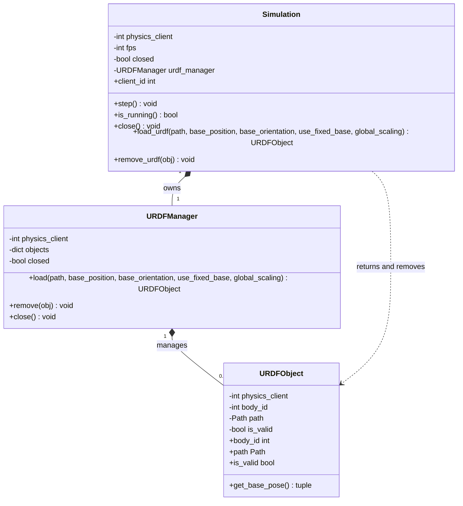

# Simulation Class Diagram

`Simulation` owns the PyBullet connection and delegates URDF lifecycle
operations to `URDFManager`. The manager creates and tracks each `URDFObject`,
while `URDFObject` acts as a handle to a body loaded in the simulation.
